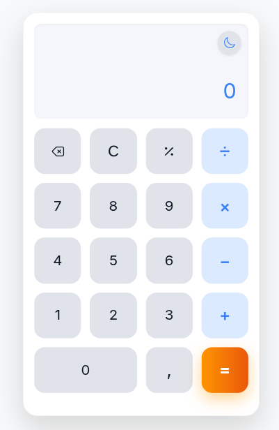
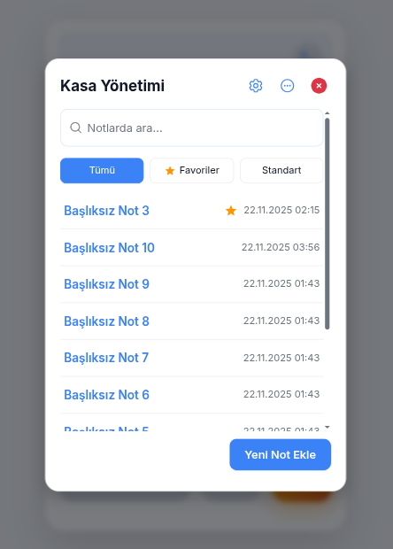
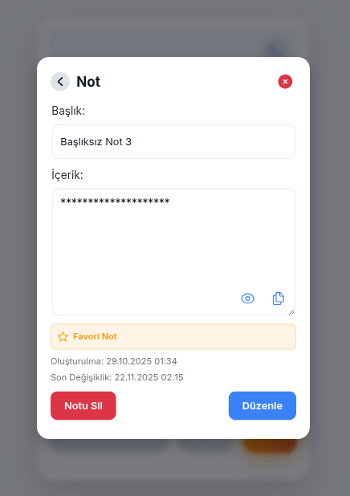
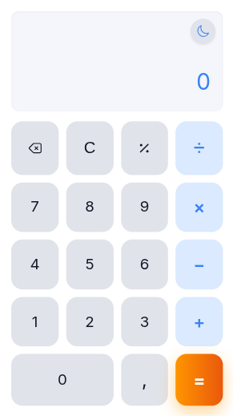
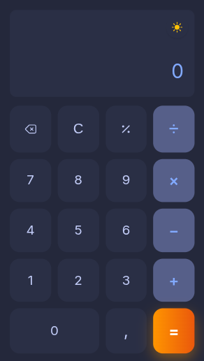
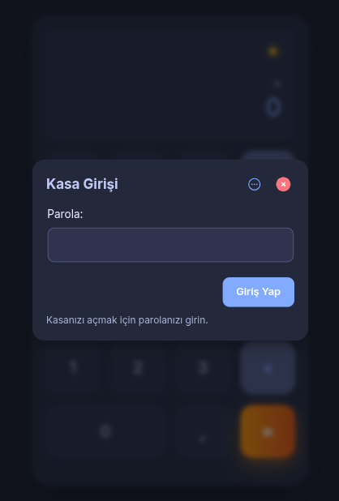

# Hesapp v1.3.99

<div align="center">


**Hesap Makinesi & Gizli Kasa**

[🌐 Canlı Demo](https://huseyinacikgoz.com.tr/hesapp/) • [📧 İletişim](mailto:mail@huseyinacikgoz.com.tr) • [🐦 Twitter](https://x.com/huseyinacikgoz_) • [💻 GitHub](https://github.com/huseyinacikgoz)

[](https://huseyinacikgoz.com.tr/hesapp/)
[](LICENSE)
[](https://huseyinacikgoz.com.tr/hesapp/)

</div>

## 📖 Hakkında

**Hesapp**, standart bir hesap makinesi işlevselliğini, güçlü şifreleme ile korunan kişisel bir not kasasıyla birleştiren minimalist bir web uygulamasıdır.

Uygulama, basit bir hesap makinesi arayüzünün ardında, notlarınızı güvende tutan şifreli bir kasa gizler. Verileriniz, yalnızca sizin bildiğiniz bir parola ile cihazınızda şifrelenir ve **asla internete gönderilmez**.

## ✨ Özellikler

### 🧮 Hesap Makinesi
- Temel aritmetik işlemler (toplama, çıkarma, çarpma, bölme)
- Yüzde hesaplama
- Sonuç kopyalama
- Temiz ve minimalist arayüz
- Klavye desteği

### 🔒 Gizli Kasa
- **Güçlü Şifreleme**: AES-GCM şifreleme algoritması
- **Anahtar Türetme**: PBKDF2 (600.000 iterasyon)
- **Zero-Knowledge**: Verileriniz yalnızca cihazınızda saklanır
- **Sahte Parola (Honey Password)**: Gerçek kasanızı gizlemek için sahte parola özelliği
- **Favori Notlar**: Önemli notları favorilere ekleyerek hızlı erişim sağlayın
- **Yedekleme & Geri Yükleme**: Kasanızın şifreli yedeğini alın
- **Otomatik Kilitleme**: Ayarlanabilir otomatik kilitleme süresi
- **Parola Değiştirme**: Güvenli parola güncelleme
- **Brute-Force Koruması**: Art arda yapılan hatalı parola denemeleri engelleniyor
- **Çöp Kutusu**: Silinen notlar önce çöp kutusuna taşınır, buradan geri yüklenebilir veya kalıcı olarak silinebilir

### 🎨 Kullanıcı Deneyimi
- **PWA Desteği**: Uygulamayı ana ekranınıza ekleyin, çevrimdışı kullanın
- **Açık/Koyu Tema**: Sistem temasına uyum veya manuel seçim
- **Responsive Tasarım**: Tüm cihazlarda mükemmel görünüm
- **Gizli Tetikleme**: Hesap makinesindeki `=` tuşuna 3 kez basarak kasayı açın

## 🖼️ Ekran Görüntüleri

| Hesap Makinesi | Gizli Kasa | Not Detayı |
| :---: | :---: | :---: |
|  |  |  |
| **Mobil (Açık Tema)** | **Mobil (Koyu Tema)** | **Masaüstü (Koyu Tema)** |
|  |  |  |

## 🛡️ Güvenlik ve Gizlilik

Hesapp, **"sıfır bilgi" (zero-knowledge)** prensibiyle çalışır:

- Notlarınız **AES-GCM** ile şifrelenir
- Şifreleme anahtarı, parolanızdan **PBKDF2 (600.000 iterasyon)** kullanılarak türetilir
- Tüm veriler yalnızca **cihazınızda** saklanır
- Verileriniz **asla sunucuya gönderilmez**
- Parolanız **asla saklanmaz veya bilinmez**
- **Sahte Parola**: Gerçek kasanızı gizlemek için opsiyonel sahte parola özelliği

> ⚠️ **Önemli**: Parolanızı unutmanız durumunda verilerinize erişim kalıcı olarak kaybolur. Parola kurtarma özelliği yoktur.

> 🍯 **Sahte Parola**: Sahte parola özelliği, gerçek kasanızı gizlemek için kullanabileceğiniz güvenlik özelliğidir. Sahte parola ile giriş yapıldığında, boş bir kasa gösterilir ve gerçek içeriğiniz gizlenir. Bu özellik, özellikle zorla parola söyleme durumlarında gerçek verilerinizi korumanıza yardımcı olur.

> 📊 **Gizlilik Dostu Analytics**: Google Analytics kullanmıyoruz. Self-hosted, GDPR uyumlu [Umami Analytics](https://umami.is/) ile sadece anonim kullanım istatistikleri toplanır. Çerez kullanmaz, IP adresi saklamaz.

## 🚀 Kullanım

### Canlı Versiyon
Uygulamayı doğrudan kullanmak için: [huseyinacikgoz.com.tr/hesapp](https://huseyinacikgoz.com.tr/hesapp/)

### Yerel Kurulum

1. **Depoyu klonlayın:**
   ```bash
   git clone https://github.com/huseyinacikgoz/hesapp.git
   cd hesapp
   ```

2. **Yerel sunucu başlatın:**
   ```bash
   # Python ile
   python3 -m http.server 8080
   
   # veya Node.js ile
   npx http-server -p 8080
   ```

3. **Tarayıcıda açın:**
   ```
   http://localhost:8080
   ```

### PWA Kurulumu

1. Uygulamayı tarayıcınızda açın
2. Tarayıcı menüsünden "Ana ekrana ekle" seçeneğini seçin
3. Uygulama ana ekranınıza eklenecek ve çevrimdışı çalışacaktır

## 🛠️ Teknolojiler

- **Vanilla JavaScript** (ES6 Modules)
- **HTML5** & **CSS3**
- **Web Crypto API** (Şifreleme)
- **Service Worker** (PWA)
- **LocalStorage** (Veri depolama)
- **Tailwind CSS** (Welcome page)

## 📁 Proje Yapısı

```
hesapp/
├── css/
│   └── style.css          # Ana stil dosyası
├── js/
│   ├── calculator/        # Hesap makinesi modülü
│   ├── vault/             # Kasa modülleri (crypto, ui, vault)
│   ├── main.js            # Ana giriş noktası
│   ├── theme.js           # Tema yönetimi
│   ├── toast.js           # Bildirim sistemi
│   └── pwa.js             # PWA özellikleri
├── favicon/               # Favicon dosyaları
├── index.html             # Ana HTML dosyası
├── service-worker.js      # Service Worker
└── README.md              # Bu dosya
```

## 🎯 Nasıl Kullanılır?

1. **Hesap Makinesi**: Uygulama açıldığında doğrudan hesap makinesi olarak kullanabilirsiniz.

2. **Gizli Kasayı Açma**: Hesap makinesi ekranındayken `=` tuşuna **3 kez** basın.

3. **İlk Kullanım**: İlk kez kasayı açtığınızda, verilerinizi koruyacak bir parola oluşturmanız istenir.

4. **Not Ekleme**: Kasa açıldıktan sonra "Yeni Not Ekle" butonuna tıklayarak notlarınızı oluşturun.

5. **Favoriler**: Not düzenleme ekranından notları favorilere ekleyerek hızlı erişim sağlayabilirsiniz.

6. **Sahte Parola**: Ayarlar menüsünden "Sahte Parola" seçeneğine tıklayarak sahte parolanızı belirleyebilirsiniz. Sahte parola ile giriş yapıldığında, boş bir kasa gösterilir ve gerçek içeriğiniz gizlenir.

7. **Çöp Kutusu**: Silinen notlar varsayılan olarak çöp kutusuna taşınır. Çöp kutusundaki notları geri yükleyebilir veya kalıcı olarak silebilirsiniz. Ayarlar menüsünden çöp kutusu özelliğini tamamen kapatabilirsiniz.

8. **Yedekleme & Geri Yükleme**: Ayarlar menüsünden kasanızın şifreli yedeğini indirebilir veya daha önceki bir yedeği geri yükleyebilirsiniz.

## 📝 Lisans

Bu proje [MIT Lisansı](LICENSE) altında lisanslanmıştır.

## 👨‍💻 Geliştirici

**Hüseyin Açıkgöz**

- 🌐 Website: [huseyinacikgoz.com.tr](https://huseyinacikgoz.com.tr)
- 📧 Email: [mail@huseyinacikgoz.com.tr](mailto:mail@huseyinacikgoz.com.tr)
- 🐦 Twitter: [@huseyinacikgoz_](https://x.com/huseyinacikgoz_)
- 💻 GitHub: [@huseyinacikgoz](https://github.com/huseyinacikgoz)

## 🤝 Katkıda Bulunma

Katkılarınızı bekliyoruz! Lütfen:

1. Fork edin
2. Feature branch oluşturun (`git checkout -b feature/amazing-feature`)
3. Değişikliklerinizi commit edin (`git commit -m 'Add amazing feature'`)
4. Branch'inizi push edin (`git push origin feature/amazing-feature`)
5. Pull Request açın

## 📊 Versiyon

**v1.3.99** - Güncel sürüm

## 🔗 Bağlantılar

- [🌐 Canlı Demo](https://huseyinacikgoz.com.tr/hesapp/)
- [📧 İletişim](mailto:mail@huseyinacikgoz.com.tr)
- [🐦 Twitter](https://x.com/huseyinacikgoz_)
- [💻 GitHub](https://github.com/huseyinacikgoz)

---

<div align="center">

**⭐ Beğendiyseniz yıldız vermeyi unutmayın! ⭐**

Made with ❤️ by [Hüseyin Açıkgöz](https://huseyinacikgoz.com.tr)

</div>
